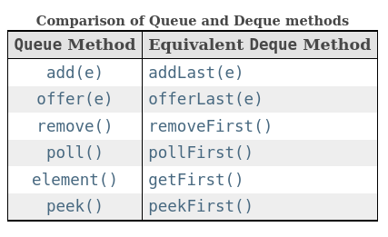

# Queue

An abstract data type that serves as a collection of elements. The order in which elements come off a queue: FIFO.

Simple representation of adding and removing elements from a queue:

## Implementing in Java

[ArrayDeque](https://docs.oracle.com/en/java/javase/17/docs/api/java.base/java/util/ArrayDeque.html) is a handy class
providing queue functionalities.

When this class is used as a `Queue`, FIFO (First-In-First-Out) behavior results. Elements are added at the end of the
deque and removed from the beginning. The methods inherited from the Queue interface are precisely equivalent to Deque
methods as indicated in the following table:

Methods:

* `add()`, adds an element to the **end**, throws an exception if no space is currently available;
* `offer()`, adds an element to the **end**, returns false if no space is currently available, preferable to the `add()`
  when using a capacity-restricted collection;
* `remove()`, retrieves and removes the head, or throws exception if the queue is empty;
* `poll()`, retrieves and removes the head, or returns `null` if the queue is empty;
* `element()`, retrieves, but does not remove, the head of the queue, or throws exception if the queue is empty;
* `peek()`, retrieves, but does not remove, the head of the queue, or returns `null` if the queue is empty.

Limitations:

* Users of any Deque implementations that do allow null elements are strongly encouraged not to take advantage of the
  ability to insert nulls. This is so because null is used as a special return value by various methods to indicate that
  the deque is empty.

## References

* [Wikipedia](https://en.wikipedia.org/wiki/Queue_(abstract_data_type))
* [Java interface Deque<E>](https://docs.oracle.com/en/java/javase/17/docs/api/java.base/java/util/Deque.html)