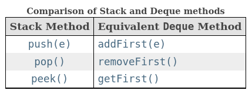

# Stack

An abstract data type that serves as a collection of elements. The order in which elements come off a stack: LIFO.

Simple representation of a stack runtime with push and pop operations:

## Implementing in Java

[ArrayDeque](https://docs.oracle.com/en/java/javase/17/docs/api/java.base/java/util/ArrayDeque.html) is a handy class
providing stack functionalities.

`Deques` can also be used as LIFO (Last-In-First-Out) stacks. This interface should be used in preference to the legacy
`Stack` class. When a deque is used as a stack, elements are pushed and popped from the beginning of the deque. Stack
methods are equivalent to Deque methods as indicated in the table below:

Methods:

* `push()`, adds an element to the **head**, throws an exception if no space is currently available;
* `pop()`, retrieves and removes the head, or throws exception if the collection is empty;
* `peek()`, retrieves, but does not remove, the head of the stack, or returns `null` if the stack is empty.

Limitations:

* Users of any Deque implementations that do allow null elements are strongly encouraged not to take advantage of the
  ability to insert nulls. This is so because null is used as a special return value by various methods to indicate that
  the deque is empty.

## References

* [Wikipedia](https://en.wikipedia.org/wiki/Stack_(abstract_data_type))
* [Java interface Deque<E>](https://docs.oracle.com/en/java/javase/17/docs/api/java.base/java/util/Deque.html)
